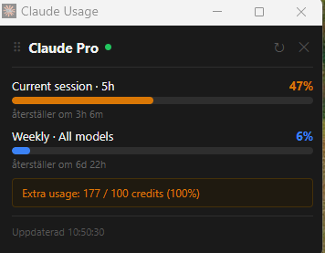

# Claude Usage Monitor

A Microsoft Edge extension that shows your Claude Pro session and weekly quota in a floating window.

## Features

- Live progress bars for current session (5h) and weekly usage
- Shows time until quota resets
- Extra usage credit tracking (when enabled on your account)
- Auto-refreshes every 5 minutes in the background
- Floating window that snaps to the correct size automatically
- Click the extension icon to toggle the window open/closed

## Requirements

- Microsoft Edge (or any Chromium-based browser)
- An active [Claude Pro](https://claude.ai) subscription
- You must be logged in to claude.ai in the same browser profile

> The extension reads usage data from the claude.ai API using your existing browser session — no API keys or credentials are stored.

## Installation

1. Clone or download this repository
2. Open Edge and go to `edge://extensions`
3. Enable **Developer mode** (toggle in the bottom-left)
4. Click **Load unpacked** and select the `claude_edge_extension` folder
5. Click the extension icon in the toolbar to open the usage window

## Usage

- **Click the icon** to open or close the floating window
- **↻ button** to manually refresh data
- The window positions itself in the bottom-right corner of your screen

## Permissions

| Permission | Reason |
|---|---|
| `storage` | Cache usage data between refreshes |
| `alarms` | Trigger background refresh every 5 minutes |
| `windows` | Create and manage the floating window |
| `system.display` | Position the window in the bottom-right corner |
| `https://claude.ai/*` | Fetch usage data from the claude.ai API |

## Privacy

All data stays local. The extension only communicates with `claude.ai` using your existing logged-in session cookie — no data is sent anywhere else, and nothing is stored beyond your own browser's local storage.
